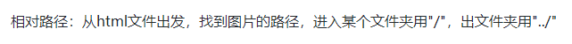

# 01html5骨架

> \<!DOCTYPEhtml>              `<!-- 文本类型定义，必须在第一行 -->`
>
> <htmllang="en">             `<!-- 默认英文开发，中文cn、zh、zh-CN -->`
>
> \<head>                       `<!-- head：网页配置 -->`
>
> <metacharset="UTF-8">`<!-- meta：元，表示配置 -->`
>
> <metahttp-equiv="X-UA-Compatible"content="IE=edge">`<!-- edge和ie渲染方式一样 -->`
>
> <metaname="viewport"content="width=device-width, initial-scale=1.0">`<!-- 视口标签 -->`
>
> <metaname="renderer"content="webkit">`<!-- 用尽可能高级内核打开 -->`
>
> <metaname="keywords"content="阿巴,阿巴阿巴">`<!-- 关键字 -->`
>
> <metaname="description"content="描述">`<!-- 描述，和关键字一同为搜索引擎服务 -->`
>
> `<title>`Document `</title>`
>
> \</head>
>
> \<body>                        `<!-- body：网页的真实内容 -->`
>
> \<h1>dsafdfd\</h1>
>
> \</body>
>
> \</html>

# 02html基本语法

### 标签分为单标签和双标签，根据标签内部存放的内容不同，将标签分为两个级别

**容器级** 和 **文本级**

容器级：元素内部除了可以存放文本之外，还可以嵌套标签

文本级：元素内部只能存放文本或者文本标签

### 标签属性

k="v"

### 文本空白折叠

> \
文本空白折叠 例如 你好\

>
> \
例如             你好\

>
> 并不会显示多个空格，要用字符实体 \&nbsp; 替换空格
>
> \
例如\&nbsp;\&nbsp;\&nbsp;你好\

# 03常用标签

### h标签

headline，h1-h6，容器级，所有的标题标签的权重都比别的标签高

权重，h1权重最高，直接理解搜索引擎除了meta外优先抓取，通常一个页面只使用一个h1，用来制作网页logo，设置多个h1标签搜索引擎会降低排名

### p标签

paragraph，段落，文本级标签

> \
阿巴阿巴阿巴\

>
> 缩进2字符

### img标签

文本级标签

> \
>
> src：引用图片的路径
>
> alt：图片加载不出来时的替换文本
>
> title：鼠标悬停文本
>
> width：宽度
>
> height：高度
>
> **同时设置两个属性会导致变形，设置一个就好，等比例缩放**
>
> border：边框，废弃，用css

### 相对路径和绝对路径

**相对路径**：从html文件出发，找到图片的路径，进入某个文件夹用"/"，出文件夹用"../"

    图片：

**绝对路径**：

    盘符：通过盘符找位置，工作中不用，服务器中没有

    网站的绝对路径：--

### 锚点，a标签

anchor，在指定位置添加一个超级链接

> href：hypertext reference，超文本引用,可以绝对路径也可以相对路径
>
> target：是否在新标签页打开链接，target="_blank"，必须是_blank
>
> title：鼠标悬停文本

**锚点**：点击链接页内跳转，两种方法

一：name属性 ``，`<a href="#img标签">img标签</a>`，name就是跳转的点，href一定要加 #

二：ID号 `<h2 id="h2">一堆h标签</h2>`

# 04列表

### 无序列表 ul；li

ul：unordered list；li：list item（列表项）

ul内只能嵌套li，li内可以嵌套任何标签包括ul

无序列表之间没有先后顺序，样式由css控制

### 有序列表 ol；li

ol：ordered list

同无序标签

### 定义列表 dl；dt；dd

dl：definition list，创建一个自定义列表结构

dt：definition term，定义主题或术语，表示一个列表的主题

dd：definition description，定义解释项，解释说明前面的主题内容

定义一个标题和内容自定义的列表结构（比如商品分类介绍）

dl内只能存放dt和dd，dt和dd同级

一个dt可以有多个dd解释，dd解释最近的dt

# 表格

### 表格基础 table；tr；td

table：表格，定义一个表格结构

tr：table rows，行

td：table dock，定义表格单元格

table里面放tr，tr里面放td

th表头

### 单元格合并

给td和th便签设置相关属性

rowspan：上下跨行合并

colspan：左右跨列合并

属性值是数字，数字是几就代表跨几行或几列

### 表格分区

一个表格主要有三个部分：标题，表头，表格主体

caption：定义主题

thead：头部，内部嵌套tr>th

tbody：主体，内部嵌套tr>td

# 布局标签 div；span

div和span都是常用的布局标签，俗称盒子，用来分割页面布局

div是跨度布局分割，span是文字分割
